# Deploying MLflow on Amazon EKS with RDS PostgreSQL
## A Backend Store for Production-Ready ML Experiment Tracking  

If you have ever worked on a machine learning project beyond the prototype stage, you will know how quickly experiment tracking becomes painful. Which model version performed best? What hyperparameters did you use two weeks ago? Did the latest training run improve accuracy?
MLflow solves this by providing a central platform to log parameters, metrics, models, and artifacts. But running it locally does not cut it for teams. You need a setup that is persistent, scalable, and accessible to everyone.
In this tutorial, we walk through deploying MLflow on Amazon EKS (Elastic Kubernetes Service) backed by an Amazon RDS PostgreSQL database. We use an EC2 instance as a gateway to configure the database, and Helm to deploy MLflow cleanly into a Kubernetes namespace.

By the end of this guide you will have:  
•	A production-grade MLflow tracking server running on EKS  
•	Persistent experiment storage in Amazon RDS PostgreSQL  
•	A working knowledge of the AWS infrastructure involved  
•	Clean teardown steps to avoid surprise AWS bills  

---

## Architecture Overview  
Before diving in, here is a quick map of the components we will build and how they connect:  
•	Amazon RDS PostgreSQL - serves as MLflow's backend store (persists experiments, runs, metrics, parameters)  
•	Amazon EC2 instance - used as a jump host to connect to RDS and create the database and user  
•	Amazon EKS cluster - runs the MLflow server as a Kubernetes deployment managed by Helm  
•	Helm chart (community-charts/mlflow) - packages and configures the MLflow deployment  
•	kubectl port-forward - tunnels local access to the MLflow UI during development  

Note: RDS is not publicly accessible by default. The EC2 instance allows us to connect from inside the same VPC to bootstrap the database.  

## Part 1: Setting Up the RDS PostgreSQL Database  

**Step 1: Navigate to Aurora and RDS - Create Database**  
Log into the AWS Management Console and navigate to Aurora and RDS from the top navigation bar. Click on Databases in the left sidebar, then click the Create database dropdown and select Full configuration. This gives us fine-grained control over the instance type, credentials, and security settings - important for a production backend store.

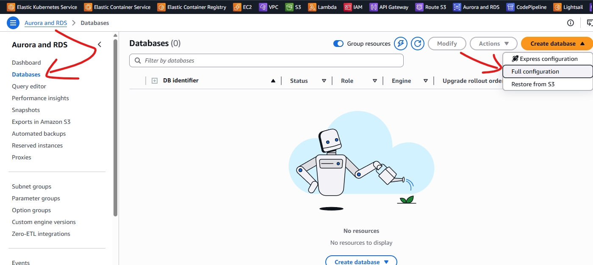  

---


**Step 2: Choose PostgreSQL as the Engine**  
On the Create Database page, select PostgreSQL as the engine type. MLflow supports several database backends (SQLite, MySQL, PostgreSQL, MSSQL), but PostgreSQL is the recommended choice for production deployments due to its reliability, rich feature set, and excellent AWS RDS support.
We will use the **Easy Create** method in this demonstrtaion. Make sure you select PostgreSQL specifically and not Aurora (PostgreSQL Compatible), which is a different, more expensive service.
 
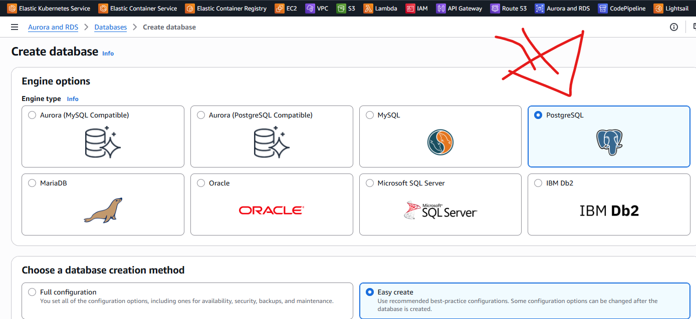  

---


**Step 3: Configure the Database Instance**  
Now, let's configure the database instance. The key settings to pay attention to are:  
•	DB instance size: Select Free tier (db.t4g.micro) for this demo. For production, choose db.t3.medium or larger depending on team size.
•	DB instance identifier: Using a descriptive name like mlflow-eks-rds-mlops-demo-ucheor makes it easy to identify.
•	Master username: Set to postgres (the default admin user). 
•	Credentials management: Select Self managed and enter a strong master password. Store this securely - we will need it shortly.

Note: Never use "Auto generate password" for a password you will not be shown again without extra steps. Choose Self managed and record it securely.
 
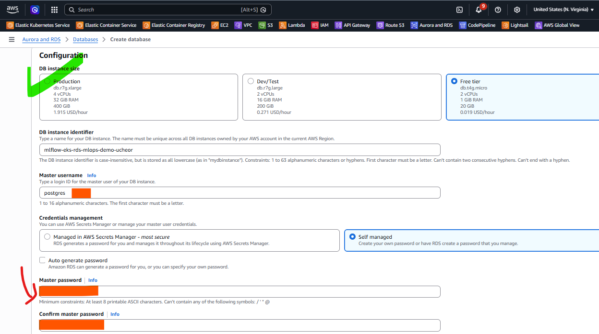  

---


**Step 4: Confirm the Database Was Created**  
After clicking Create database, AWS will begin provisioning your RDS instance. This takes 3-5 minutes. You will see the status show as "Backing-up" initially, which means the database has been created and AWS is taking an initial snapshot.
Once the status becomes Available, your RDS PostgreSQL instance is ready. Note the DB identifier - we will use its endpoint in later steps to connect.
 
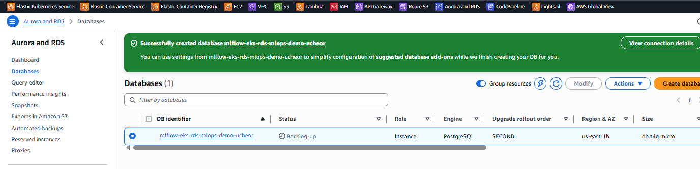  

---

**Step 5: Copy the Database Endpoint**  
Click on your database identifier to open its details page. Navigate to the Connectivity and security tab. Under the Endpoint and port section, copy the full endpoint URL. It will look like: mlflow-eks-rds-mlops-demo-ucheor.xxxxxxxx.us-east-1.rds.amazonaws.com
Also note: the port is 5432 (standard PostgreSQL) and the VPC security group attached is the default group. We will need to modify this security group's inbound rules later to allow our EC2 instance to reach port 5432. 
Note: In your setup, you can go with your preferred VPC and security group as long as you remember to create the EC2 jump server in the same VPC to follow along with this demo without extra configurations.
 
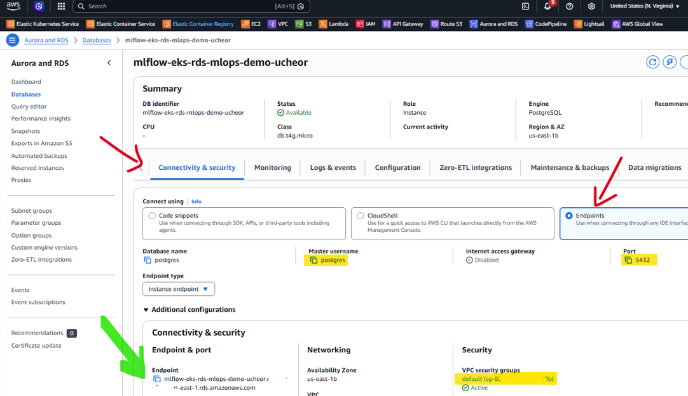  

---

## Part 2: EC2 Instance and Security Group Configuration  

**Step 6: Confirm Your EC2 Instance Is Running**  
We need an EC2 instance that lives in the same VPC as our RDS database. Create an instance in your AWS account. This acts as a bastion or jump host to connect to the RDS instance from within the private network.
Navigate to EC2 and Instances and confirm your demo instance is in a Running state. In this walkthrough we use a t3.medium Ubuntu instance named demo-instance-ucheor. Note the security group attached to it - we will reference this when configuring the RDS inbound rules.
 
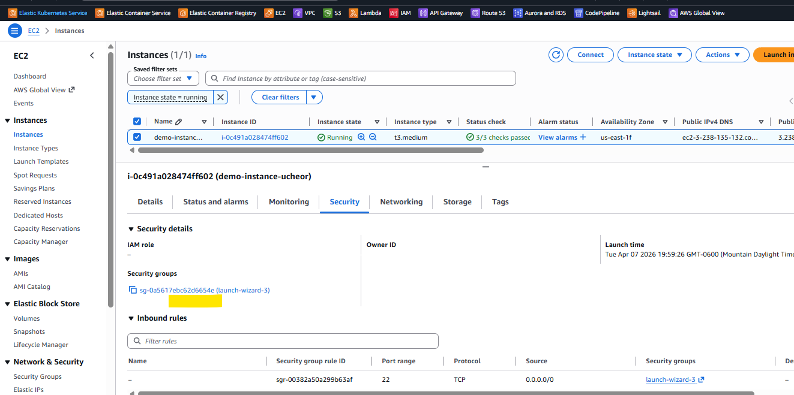

---

**Step 7: Find the RDS Security Group and Open Inbound Rules**  
For our EC2 instance to connect to RDS on port 5432, we need to add an inbound rule to the RDS security group. Navigate to your RDS Connectivity & Security Tab and find the default security group attached to your RDS instance. You will need to edit this security group to give access to the EC2 jump server and click Edit inbound rules.
Note: The default VPC security group is shared across resources. In production, use a dedicated security group for RDS rather than the default.
 
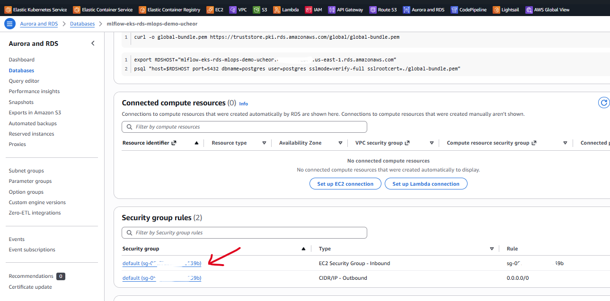  

---

**Step 8: Review Existing Inbound Rules**  
We need to add a new rule to allow TCP traffic on port 5432 (PostgreSQL) from the EC2 instance security group. Rather than opening it to 0.0.0.0/0 (all IPs), we scope access to only the specific EC2 security group - a much more secure approach.
 
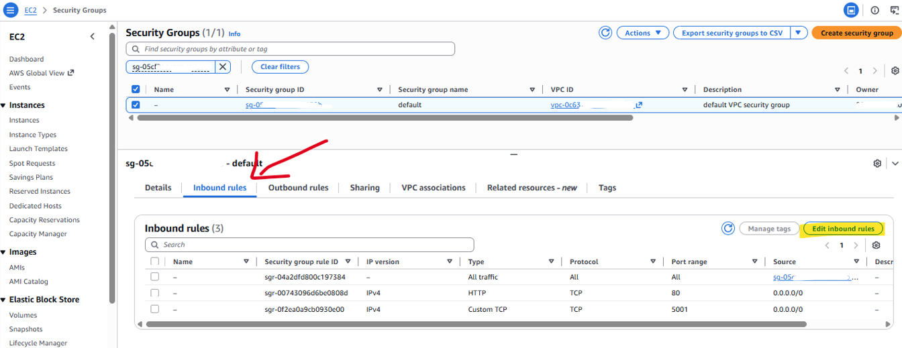  

---

**Step 9: Add the PostgreSQL Inbound Rule**  
Click Add rule and configure: Type = Custom TCP, Port range = 5432, Source = Custom, then search for and select the security group attached to your EC2 jump server. This tells the RDS security group to allow inbound PostgreSQL connections only from resources attached to that specific EC2 security group.
Click Save rules when done.  
Note: Scoping the source to a security group rather than an IP range is a best practice - it survives EC2 IP changes and is easier to manage at scale.
 
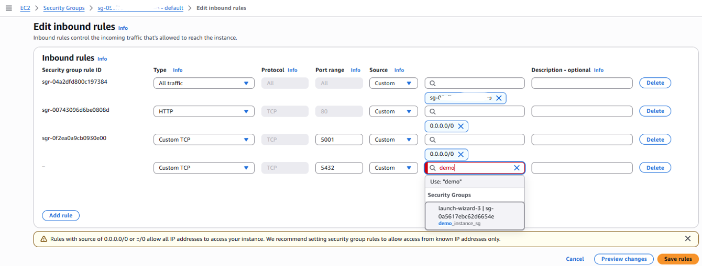 

---

## Part 3: Database Bootstrap via EC2  

**Step 10: Install the PostgreSQL Client on EC2**
SSH into your EC2 instance. We need the psql client tool to connect to RDS and run SQL commands. Visit postgresql.org/download and follow the installation instructions as needed. In as much as we do not need a local PostgreSQL server running, we need the psql command-line client to communicate with our remote RDS instance.

```
sudo apt update
sudo apt install -y curl ca-certificates gnupg


sudo install -d /usr/share/postgresql-common/pgdg

curl -fsSL https://www.postgresql.org/media/keys/ACCC4CF8.asc | \
  sudo gpg --dearmor -o /usr/share/postgresql-common/pgdg/apt.postgresql.org.gpg

echo "deb [signed-by=/usr/share/postgresql-common/pgdg/apt.postgresql.org.gpg] https://apt.postgresql.org/pub/repos/apt noble-pgdg main" | \
  sudo tee /etc/apt/sources.list.d/pgdg.list


sudo apt update

sudo apt install -y postgresql-17

```

---

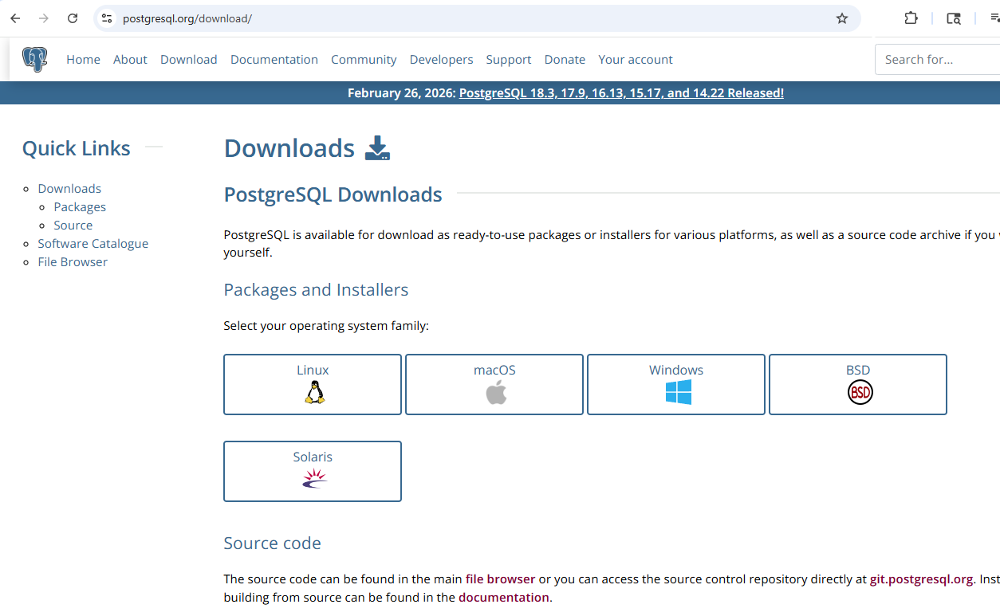

---

**Step 11: Verify the PostgreSQL Client Is Installed**  
After installation, confirm psql is working by running:

```
psql --version   # should return: psql (PostgreSQL) 18.3 or similar
systemctl status postgresql   # should show active/exited - this is normal
```

The "active (exited)" status is expected. It means the client packages installed correctly and the init script completed, but no local PostgreSQL server is running - which is fine because we are connecting to RDS, not a local instance.
 
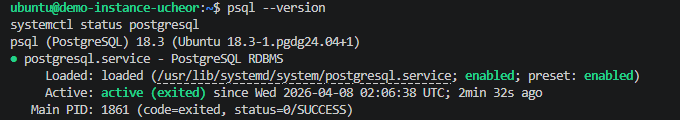  

---

**Step 12: Connect to RDS and View Existing Databases**  
Connect to your RDS instance from the EC2 terminal using the endpoint you copied in Step 5:

```
psql -h <your-rds-endpoint> -p 5432 -U postgres
```

Enter the master password you set during RDS creation. Once connected, run \l to list all databases. You will see the default system databases (postgres, rdsadmin, template0, template1). This confirms connectivity is working correctly between EC2 and RDS.

Note: If the connection times out, double-check that the inbound rule from Step 9 was saved correctly with port 5432 pointing to the EC2 security group.
 
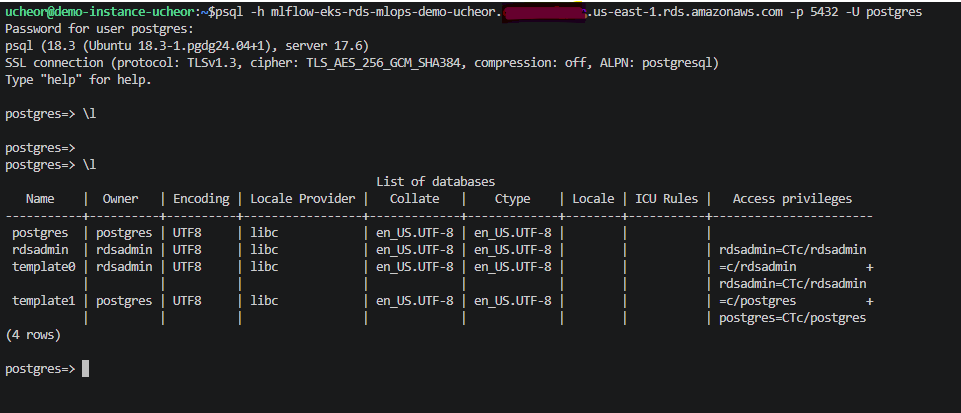  

---

**Step 13: Create the MLflow Database and User**  
With the connection confirmed, run the following SQL commands to set up MLflow's dedicated database and user:

```
CREATE DATABASE demo_mlflow_db;
CREATE USER demo_mlflow_db_user WITH PASSWORD 'mlflow-eks-rds';
GRANT ALL PRIVILEGES ON DATABASE demo_mlflow_db TO demo_mlflow_db_user;
\c demo_mlflow_db   # to switch to the new database
GRANT ALL ON SCHEMA public TO demo_mlflow_db_user;

```

Why a dedicated user? It is a security best practice to avoid using the master postgres user for application connections. The MLflow service will connect using demo_mlflow_db_user - limiting the blast radius if that credential is ever compromised.
 
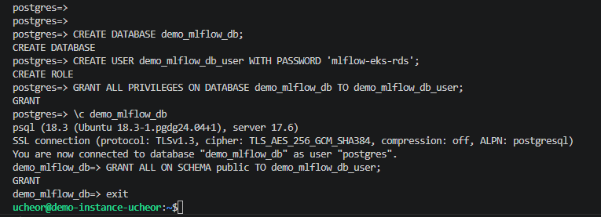  

---

## Part 4: Creating the EKS Cluster

**Step 14: Initiate EKS Cluster Creation with eksctl**  
With the database ready, we will go ahead and create the Kubernetes cluster that will host MLflow. We will use eksctl with a cluster.yaml configuration file.

**Understanding the cluster.yaml Configuration File**  
Rather than passing dozens of flags on the command line, eksctl accepts a declarative YAML configuration file. Here is the full cluster.yaml used in this walkthrough, with each section explained:

```
apiVersion: eksctl.io/v1alpha5
kind: ClusterConfig
 
metadata:
  name: mlflow-cluster
  region: us-east-1
 
vpc:
  id: "vpc-06c6374xxxxxxxx77"  # same VPC as your RDS database - update
  subnets:                     # update - see notes below
    public:
      us-east-1a: { id: "subnet-16dbxxxxxxxxddc56" }
      us-east-1b: { id: "subnet-229xxxxxxxxx8c9cd" }
      us-east-1c: { id: "subnet-36cxxxxxxxxxxxx46" }
 
managedNodeGroups:
  - name: mlflow-nodes
    instanceType: t3.large
    desiredCapacity: 2
    securityGroups:
      attachIDs: ["sg-05cfxxxxxxxxxxxb"]  # RDS VPC security group ID

```

**Breaking Down Each Section**  

- apiVersion and kind
These declare this as an eksctl configuration file. The apiVersion must match your installed eksctl version (v1alpha5 is the current stable schema). The kind: ClusterConfig tells eksctl that this file defines a full cluster configuration.
- metadata: name and region
Sets the cluster name to mlflow-cluster and deploys it in us-east-1 (N. Virginia). The cluster name is used throughout AWS (CloudFormation stacks, IAM roles, kubeconfig context). Choose a name that clearly identifies the project - you will see it frequently in CLI output and the AWS console.
- vpc: id (Critical - match your RDS VPC to follwo with this hands-on steps)
This is the most important field in the file. By specifying the same VPC ID as your RDS instance, you ensure the EKS worker nodes are deployed into the same private network as the database. Without this, the MLflow pod would not be able to reach the RDS endpoint, since RDS is not publicly accessible.
To find your VPC ID, navigate to the RDS instance details page, click the Connectivity and security tab, and look in the Networking section. You can also find it in the VPC console.
- vpc: subnets (public, multi-AZ)
EKS requires subnets in at least two Availability Zones - this is a hard requirement, not optional. We specify three public subnets across us-east-1a, us-east-1b, and us-east-1c to maximise availability. These subnets must already exist in the VPC specified above. You can find the subnet IDs in the VPC console under Subnets, or by checking the RDS instance subnet group.
We use public subnets here for simplicity. In a production setup you would place worker nodes in private subnets with a NAT gateway, keeping them off the public internet entirely.
- managedNodeGroups: instanceType and desiredCapacity
Defines the EC2 worker nodes that will run your Kubernetes pods. instanceType: t3.large gives each node 2 vCPUs and 8 GB RAM - sufficient for running MLflow and leaving headroom for other workloads. desiredCapacity: 2 means two worker nodes will be launched, spread across the Availability Zones defined above.
Managed node groups are recommended over self-managed nodes because AWS handles patching, scaling, and node replacement automatically. EKS also automatically drains nodes before termination, reducing the risk of disrupting running pods.
- securityGroups: attachIDs (Critical - enables RDS connectivity)
This is the second critical field. By attaching the RDS security group to the EKS worker nodes, we ensure that all MLflow pods running on those nodes are treated as members of that security group. Remember in Step 9 we added an inbound rule to the RDS security group allowing port 5432 from itself (the self-referencing All traffic rule). This means EKS nodes with this security group attached can reach RDS on port 5432 automatically.

**Note:** When adapting this for your own setup, you must replace the vpc.id, all three subnet IDs, and the securityGroups.attachIDs with values from your own AWS account. The cluster name and region can be anything you choose.

Let's now go ahead and create our EKS cluster

```
eksctl create cluster -f cluster.yaml
```

This step takes 15-20 minutes. You will see detailed logs showing VPC selection, subnet configuration, node group creation, and Kubernetes add-ons being installed (vpc-cni, kube-proxy, coredns, metrics-server).
Note: eksctl automatically configures your local kubeconfig so subsequent kubectl commands will target the new cluster.
 
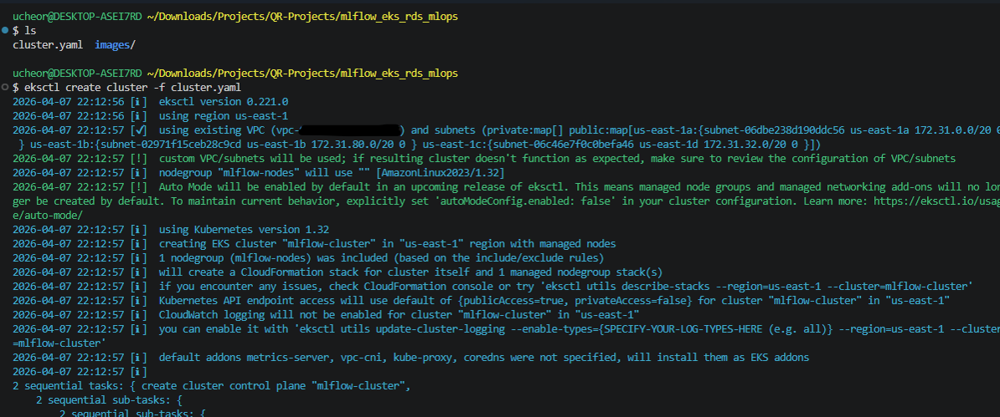 

---

**Step 15: Create Kubernetes Namespace and Add Helm Repository**
Once the cluster is up, prepare the Helm deployment environment:

```
kubectl create ns mlflow   # creates a dedicated namespace for MLflow resources
helm repo add community-charts https://community-charts.github.io/helm-charts
helm repo update   # fetches latest chart versions
```

Using a dedicated namespace is important: it keeps MLflow resources separate from other workloads, makes RBAC easier to manage, and simplifies teardown - you can delete the entire namespace to remove everything MLflow-related in one command.
 
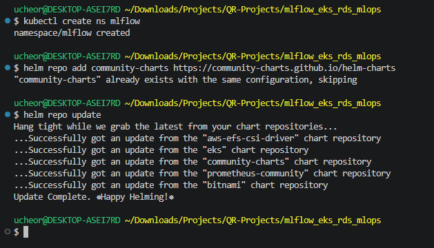   

---

**Step 16: Deploy MLflow with Helm**  
Deploy MLflow using Helm, passing all PostgreSQL connection details as chart values:

```
helm install mlflow community-charts/mlflow \
  --namespace mlflow \
  --set service.type=ClusterIP \
  --set backendStore.databaseMigration=true \
  --set backendStore.postgres.enabled=true \
  --set backendStore.postgres.host=<your-rds-endpoint> \ # remember to update
  --set backendStore.postgres.port=5432 \
  --set backendStore.postgres.database=demo_mlflow_db \
  --set backendStore.postgres.user=demo_mlflow_db_user \
  --set backendStore.postgres.password=<add-your-database-password>  # update to your password
```

**Key flags:** 
- databaseMigration=true tells MLflow to run Alembic migrations on startup, automatically creating all required tables in PostgreSQL.   
- service.type=ClusterIP means the service is only accessible within the cluster.   

A successful deployment shows STATUS: deployed and REVISION: 1.
 
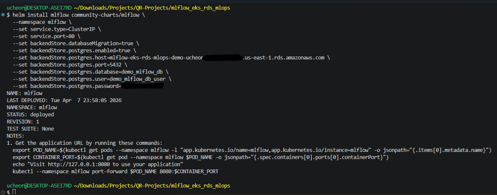  

---

**Step 17: Verify MLflow Pods Are Running**  
Confirm the deployment is healthy:

```
kubectl get pods -n mlflow   # should show 1/1 Running
kubectl get all -n mlflow   #shows pod, service, deployment, and replicaset
```

You should see the MLflow pod with STATUS: Running and RESTARTS: 0. The service shows as ClusterIP on port 80. This confirms MLflow started successfully and connected to RDS to run database migrations.
Note: If the pod shows CrashLoopBackOff, check logs with: kubectl logs <pod-name> -n mlflow. The most common cause is incorrect RDS credentials or an unreachable endpoint. 
 
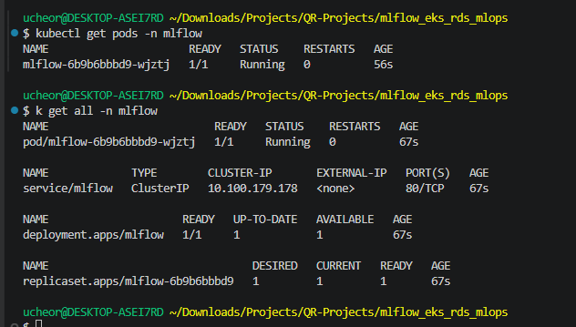  

---

## Part 5: Accessing the MLflow UI

**Step 18: Port-Forward to Access the MLflow Dashboard**
Since the MLflow service is of type ClusterIP (no external IP), use kubectl port-forward to tunnel it to your local machine:

```
kubectl port-forward svc/mlflow 5000:80 -n mlflow
```

This forwards port 5000 on your local machine to port 80 of the MLflow service inside the cluster. Open your browser and navigate to http://localhost:5000. Keep this terminal open while using the UI - **closing it will terminate the tunnel**. You can test the next steps that need a terminal on a new terminal.

Note: For production, expose MLflow via a LoadBalancer service or Ingress with TLS. Port-forwarding is for development and testing only.
 
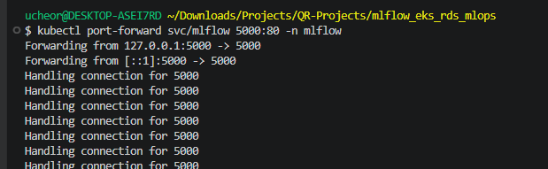  

---

**Step 19: MLflow Dashboard Is Live**  
Navigate to http://localhost:5000 and you should see the MLflow welcome screen. This confirms the full stack is working end-to-end: your browser connects through the kubectl tunnel to the EKS pod, which reads and writes to RDS PostgreSQL.

The dashboard shows four main capabilities: Log traces (LLM debugging), Run evaluation (offline model comparisons), Train models (experiment tracking), and Register prompts (team prompt management).
Notice the "Default" experiment was created automatically - this was created the moment the MLflow server first connected to RDS and initialized the backend database. Data persistence is working.
 
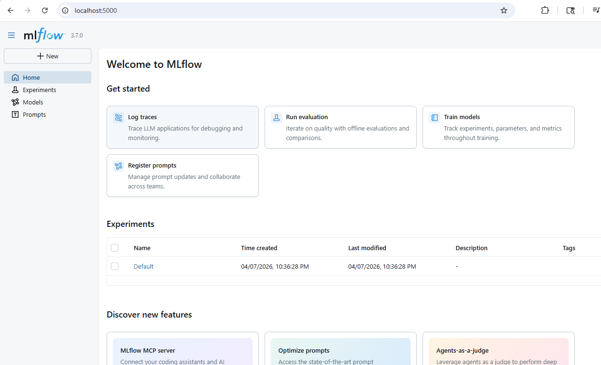  

---

**Step 20: Confirm the Experiments Tab**  
Click Experiments in the left sidebar. You will see the Default experiment listed, created when MLflow first initialized. This experiment list is stored in your RDS PostgreSQL database - not in the pod's local storage - so it will survive pod restarts and redeployments.
This is the key benefit of using RDS as a backend store: your experiment history is durable. If the pod crashes, restarts, or is replaced during a rolling update, all your logged runs remain intact in the database.
 
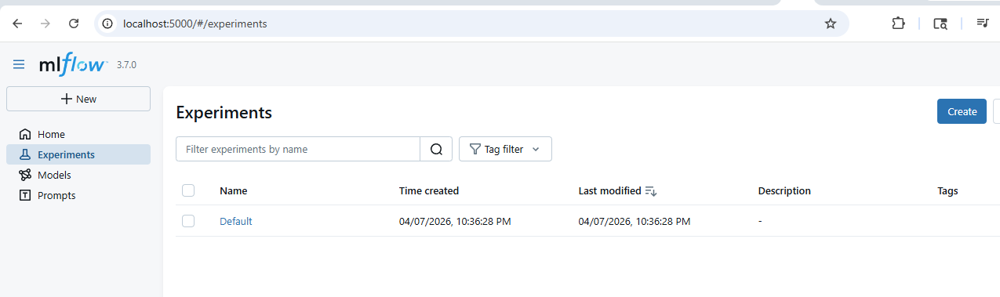  

---

## Part 6: Testing Experiment Tracking from Python

**Step 21: Install MLflow Locally and Set Up a Virtual Environment**  
To test logging experiments to our remote MLflow server, install the MLflow Python package locally. First create a virtual environment, then install mlflow:

```
python -m venv .venv
source .venv/Scripts/activate   # for Windows  or source .venv/bin/activate  for Linux/Mac
python -m pip install mlflow
```

The pip install pulls in mlflow, mlflow-skinny, mlflow-tracing, Flask, and other dependencies. Using a virtual environment ensures your MLflow client version does not conflict with other Python projects on your machine.
 
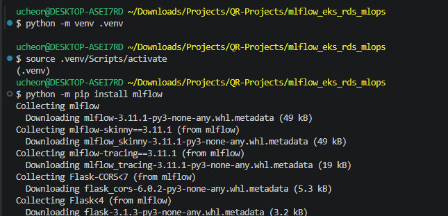  

---

**Step 22: Set the Tracking URI and Create an Experiment**  
With the port-forward still running on the previous terminal, open a Python shell on the new terminal and point the MLflow client at your local tunnel:

```
import mlflow
mlflow.set_tracking_uri("http://localhost:5000")
mlflow.set_experiment("mlflow-experiment")      #name of your new experiment
```

The set_tracking_uri call tells the MLflow client where to send all logging calls. The set_experiment call creates (or selects) a named experiment in the remote server. Since "mlflow-experiment" does not exist yet, MLflow creates it automatically and logs: "Creating a new experiment."
The returned Experiment object confirms: experiment_id=2, lifecycle_stage=active - all stored in your RDS database.
 
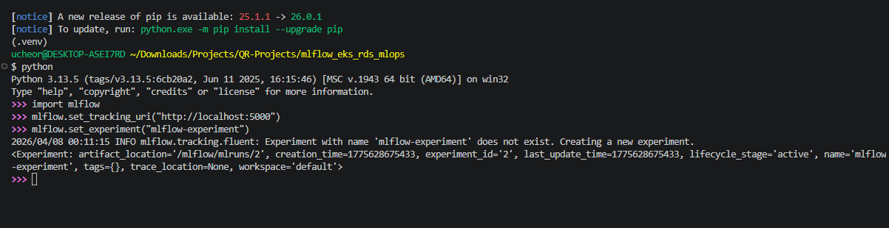  

---

**Step 23: Verify the New Experiment Appears in the UI**  
Switch back to your browser at http://localhost:5000 and click Experiments. You should now see "mlflow-experiment" listed alongside Default, with a creation timestamp matching when you ran the Python command.
This end-to-end confirmation proves the full loop is working: Python client sends data through the port-forward tunnel to the EKS pod, which writes it to RDS, and the UI reads it back from RDS.

 
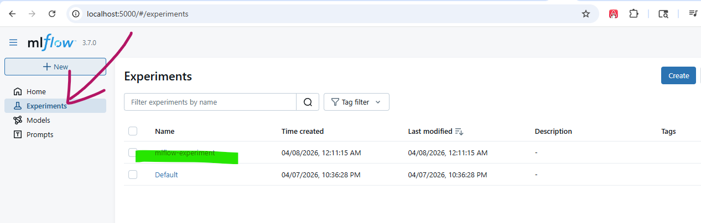  

---

## Part 7: Teardown and Cleanup

When you are done with the demo, clean up all AWS resources to avoid incurring unexpected charges. Follow these steps in order - deleting resources in the wrong order can cause dependency errors.  

**Step 24: Start EKS Cluster Deletion**  
Run the eksctl delete command to begin cluster deletion. This removes the EKS control plane and managed node group via CloudFormation:
eksctl delete cluster -f cluster.yaml

This is operation takes 10-15 minutes. The eksctl output shows it draining node groups, cleaning up load balancers, and starting CloudFormation stack deletions.
 
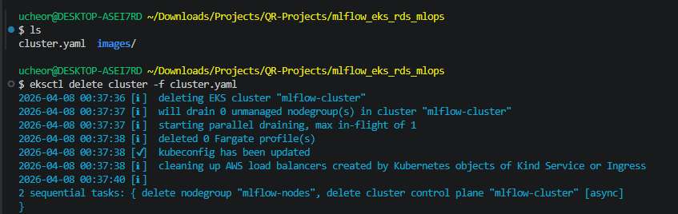  

---

**Step 25: Wait for All EKS Resources to Be Deleted**  
Monitor the deletion progress. The eksctl output shows it waiting for CloudFormation stacks to be removed - first the node group stack, then the cluster stack itself. When you see "all cluster resources were deleted", the EKS teardown is complete.
This step takes patience - CloudFormation stack deletion is thorough and checks dependencies at each stage. Do not interrupt the process.
 
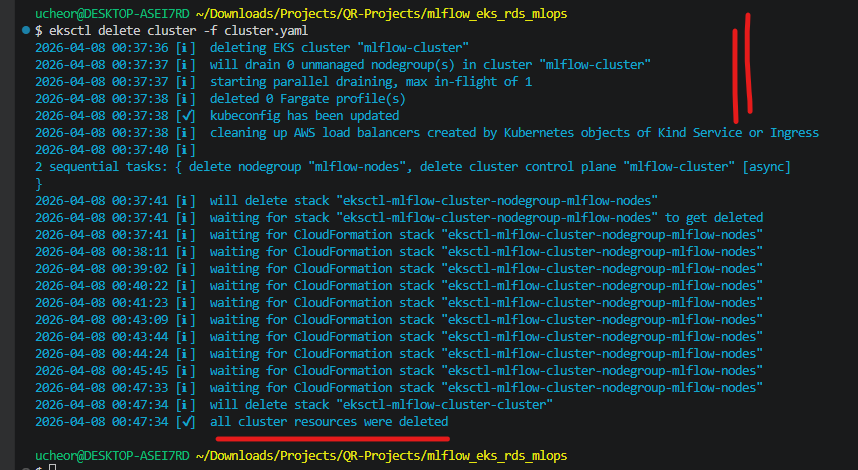  

---


**Step 26: Terminate the EC2 Instance**  
Navigate to EC2 and Instances, select jump server instance, and choose Instance state and then Terminate instance. A confirmation dialog warns that the EBS root volume will be deleted - since this was a temporary jump host, that is what we want.
Click Terminate (delete) to confirm. The instance will move to Terminated state and disappear from your instances list after a short time.
**Note: Terminating an EC2 instance is permanent and cannot be undone. Make sure you have saved any data you need from it first.

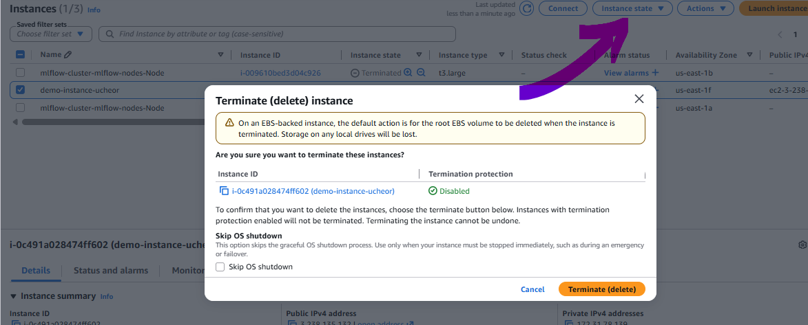  

---

**Step 27: Delete the EC2 Security Group**  
Navigate to EC2 and Security Groups, select the security group used by the demo instance, and delete it.
Important: you must terminate the EC2 instance before you can delete its associated security group. If deletion fails with a dependency error, remember to complete Step 26 first, then return here. You might also need to dissociate the security group from the RDS security group before you can delete the security group.
 
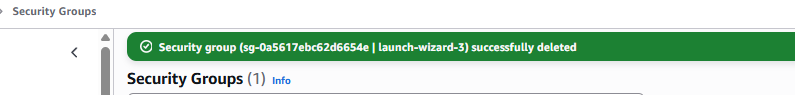  

---
 
**Step 28: Delete the RDS Database**  
Finally, delete the RDS PostgreSQL instance. Navigate to Aurora and RDS and Databases, select your database, and choose Actions and then Delete. The confirmation dialog presents several options:
•	Create final snapshot - uncheck for a demo teardown (check this for production to preserve data)
•	Retain automated backups - uncheck for full cleanup
•	Acknowledgement checkbox - check this to confirm you understand backups will be lost

Type "delete me" in the confirmation field and click Delete. This permanently removes the RDS instance and all its data.
Note: For production, always create a final snapshot before deleting an RDS instance. Deletion is irreversible.
 
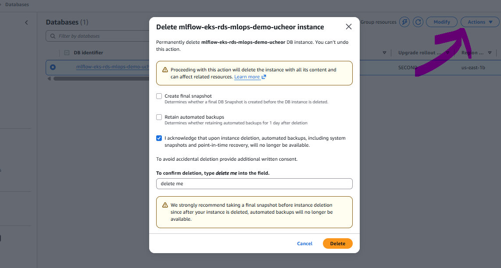  

---

## Conclusion

Congratulations - you have successfully deployed a production-grade MLflow tracking server on Amazon EKS, backed by a persistent RDS PostgreSQL database, and verified it end-to-end with Python experiment tracking.

**Here is a summary of what we built and why each piece matters:**  
•	RDS PostgreSQL - durable, managed backend store that survives pod restarts and cluster updates  
•	EC2 jump host - secure, VPC-internal way to bootstrap the database without exposing RDS publicly  
•	Security group scoping - least-privilege access control between EC2 and RDS on port 5432  
•	EKS + Helm - scalable, Kubernetes-native deployment with clean configuration management  
•	Namespace isolation - keeps MLflow resources self-contained and easy to manage or remove  
•	kubectl port-forward - simple, secure local UI access without exposing the service externally  

**What's Next?**
This setup gives you a solid foundation. From here you can extend it by:  
•	Adding an S3 artifact store so model files and plots are also stored persistently outside the pod  
•	Exposing MLflow via an AWS Load Balancer and Route 53 for team-wide access without port-forwarding  
•	Adding TLS/HTTPS with cert-manager and a Kubernetes Ingress resource  
•	Configuring MLflow authentication (Basic Auth or OAuth) for multi-user environments  
•	Integrating MLflow tracking calls into your CI/CD pipeline for automated experiment logging  

If this guide was helpful, feel free to connect and share. Happy tracking!


#MLflow #AWS #EKS #Kubernetes #RDS #PostgreSQL #MLOps #MachineLearning #DataScience #DevOps